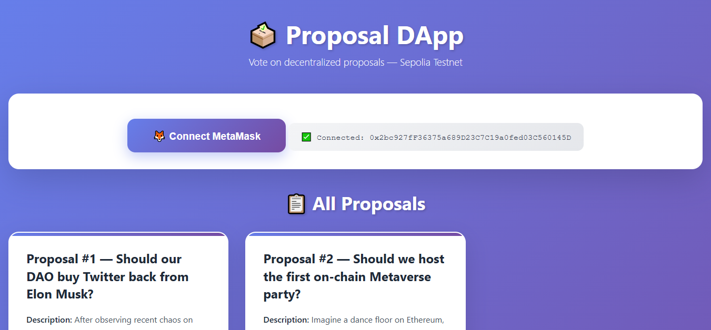
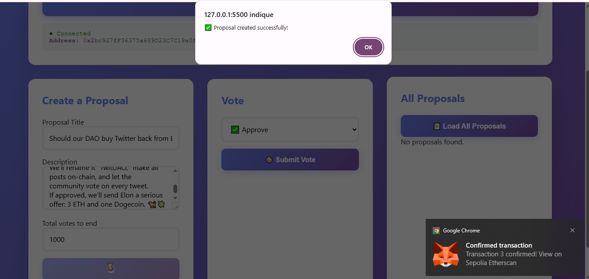

# 🗳️ Proposal DApp — Blockchain Voting Platform

A decentralized web application built with **HTML**, **CSS**, and **Web3.js** that allows users to **create**, **view**, and **vote** on proposals stored on the **Ethereum blockchain (Sepolia Testnet)**.  
The DApp connects to **MetaMask** and interacts directly with a **Solidity Smart Contract** to ensure full transparency and vote integrity.

---

## 🔎 Project Overview

This DApp allows users to:  

- Connect through **MetaMask** or **Trust Wallet**  
- Create a new proposal (title, description, vote limit)  
- View all active and closed proposals  
- Vote on a specific proposal (Approve / Reject / Pass)  
- Track vote progress in real time  
- Retrieve results directly from the blockchain  

The application is **100% decentralized**, fast, lightweight, and accessible from any modern browser.

---

## 🚀 Main Features

- 🦊 Automatic connection with **MetaMask**  
- 🗳️ Real-time creation and management of proposals  
- 🔢 Unique **ID assignment** for each proposal  
- ✅ Transparent voting system on the blockchain  
- 🔄 Automatic result refresh after every transaction  
- 🟢 Status indicator (active or closed proposal)  
- 💧 Built-in link to a **Sepolia faucet** for free ETH  
- 📱 Clean, modern, and fully responsive interface  

---

## 🧰 Technologies Used

- **Solidity (v0.8.18)** — Smart Contract  
- **Ethereum Sepolia Testnet** — Blockchain network  
- **Web3.js** — JavaScript–Ethereum interaction  
- **HTML5 & CSS3** — Frontend user interface  
- **MetaMask / Trust Wallet** — Decentralized wallets  

---

## 🧠 Architecture & Solution

- Each proposal is stored in a mapping `proposal_history` indexed by an incremental ID.  
- Every proposal includes a title, description, date, and vote counters.  
- Votes are recorded by ID using the function `vote(uint proposalId, uint8 choice)`.  
- When the predefined vote limit is reached, the proposal automatically closes.  
- Main smart contract functions:  
  - `create(title, description, limit)`  
  - `vote(proposalId, choice)`  
  - `getAllProposals()`  
  - `getProposal(id)`  

This design ensures **full transparency** and **immutability of decisions** through blockchain technology.

---

## 🖼️ Project Interface

The interface is divided into three main sections:  
- **Connection** – authentication via MetaMask.  
- **Creation** – form for submitting new proposals.  
- **Voting & Display** – dynamic proposal list with direct blockchain interaction.

---

## 🌐 Live Demo

Demo Link: [https://proposal-dapp-xi.vercel.app/](#)  
Sepolia Faucet: [https://cloud.google.com/application/web3/faucet/ethereum/sepolia](https://cloud.google.com/application/web3/faucet/ethereum/sepolia)

---

## ⚙️ Installation
1. Clone the repository:  
git clone https://github.com/yourusername/proposal-dapp.git
cd proposal-dapp

2. Deploy the Smart Contract on Remix:  
- Open Remix IDE: https://remix.ethereum.org  
- Compile using Solidity 0.8.18  
- Select “Injected Provider - MetaMask”  
- Connect to the Sepolia Testnet network  
- Deploy and copy your contract address

3. Update the Interface:  
- Open the index.html file  
- Replace the “contractAddress” variable with your deployed address  
- Paste your ABI into the “contractABI” constant

4. Run the Application:  
- Open index.html directly in your browser  
- Connect your MetaMask wallet  
- Interact with the DApp seamlessly

---

## 👤 Author

**Alfran Essone**  
💻 Web Developer & Blockchain Enthusiast  
🌍 https://alfran48.netlify.app

---

## 📄 License

This project is released under the **MIT License**.  
You are free to use, modify, and share it with attribution.

